# 🚗 Awesome-Insurance-Telematics 📡

  

  
  
  
  
  
  

---

## 🌐 Top Insurance Telematics Ecosystem

> 📌 **A curated directory of SaaS platforms, mobile edge SDKs, driving behavior algorithms, IoT hardware tools, and open-source usage-based insurance (UBI) models.**
> 
> *Keywords & SEO*: Insurance Telematics, Usage-Based Insurance (UBI), Pay-How-You-Drive (PHYD), Pay-As-You-Drive (PAYD), Driver Risk Scoring, Smartphone Telematics SDK, OBD-II CAN Bus Ingestion, Crash & FNOL Detection, Fleet Safety Analytics, Connected Car Data Exchange.
>
> 🕒 **Last updated:** August 2026

This repository tracks notable **SaaS platforms** and **open-source projects** for **Insurance Telematics**. These solutions capture and analyze vehicular sensor data (smartphone IMU/GPS, OBD-II dongles, OEM connected-car APIs, and IoT dashcams) to power usage-based insurance, actuarial risk scoring, automated First Notice of Loss (FNOL) claims processing, and safe-driving rewards.

---

## 📑 Table of Contents
- [🏢 SaaS / Hosted Platforms](#-saashosted-platforms)
- [💻 Open-Source GitHub Projects](#-open-source-github-projects)
- [🧩 Technical Ecosystem Highlights](#-technical-ecosystem-highlights)
- [🤝 How to Contribute](#-how-to-contribute)
- [📈 Star History](#-star-history)
- [⚠️ Disclaimer](#️-disclaimer)

---

## 🏢 SaaS/Hosted Platforms

> 📊 **Market Size & Structure**: The global Insurance Telematics market is estimated at **$5.8 Billion in 2026** and projected to reach **$16.5+ Billion by 2032** (CAGR of ~18.5%). The sector is **moderately fragmented with high barriers to entry**; large tier-1 carriers rely on entrenched enterprise platforms (LexisNexis, Samsara, CMT, Octo) for state-approved actuarial rating plans, while agile edge-AI and mobile SDK vendors (Damoov, Sentiance, DriveQuant) empower rapid UBI, car-sharing, and insurtech deployments.

| 🏢 Platform / Product | 💰 Company Valuation / Revenue | 📝 Description & Focus | 🏷️ Starting Pricing | 🎁 Free Tier / Free Trial Limits |
| :--- | :--- | :--- | :--- | :--- |
| **[LexisNexis Telematics](https://risk.lexisnexis.com/)** | **~$80B+ Market Cap** (RELX Group parent) / ~$4.2B Division Revenue | Telematics Data Exchange ingesting OEM and connected-car data for point-of-quote insurance scoring and risk assessment. | **$0.50 per vehicle record query** (with $2,500/month base API subscription fee) | **30-day testing sandbox trial** (limited to 500 test batch policyholder queries) |
| **[Samsara](https://www.samsara.com/)** | **~$22B+ Market Cap** (NYSE: IOT) / ~$1.25B ARR | Connected operations platform with AI safety scoring, harsh-event detection, and commercial fleet insurance underwriting telemetry. | **$27–$33/vehicle/month** (Core telematics subscription + $99 upfront hardware/device) | **30-day free trial** (evaluation hardware units and full cloud analytics dashboard access) |
| **[Motive](https://gomotive.com/)** | **~$2.85B Valuation** (Series F) / ~$300M+ ARR | AI-driven telematics and dashcam safety platform with real-time driver risk scoring and commercial insurance integrations. | **$25/vehicle/month** (Starter fleet tracking & telematics tier) | **14-day free trial** (includes hardware gateway demo unit and safety management portal) |
| **[Cambridge Mobile Telematics (CMT)](https://www.cmtelematics.com/)** | **~$1.5B+ Valuation** (SoftBank Vision Fund) / ~$150M+ ARR | Category-leading smartphone telematics & IoT platform (DriveWell) powering insurer UBI programs and automated crash detection. | **$0.80/active driver/month** (Starter volume tier with $1,500/month platform fee) | **60-day pilot trial** (includes SDK sandbox access, tag hardware samples, and scoring analytics dashboard) |
| **[Octo Telematics](https://www.octotelematics.com/)** | **~$1.2B+ Valuation** (PE Backed) / ~$400M+ Revenue | Global telematics provider offering IoT hardware, smartphone apps, crash reconstruction, and claims triage for insurers. | **$15/vehicle/month** (includes telematics device lease and cloud analytics tier) | **30-day PoC pilot trial** (evaluation package with up to 10 test hardware units and portal access) |
| **[Arity](https://www.arity.com/)** | **~$750M–$1B Valuation** (Allstate Corp parent: ~$42B Cap) / ~$100M+ Revenue | Mobility data and analytics company offering telematics-derived risk insights, Arity IQ at-quote scoring, and driving risk models. | **$0.75/active policy/month** (volume tier with $2,000/month base carrier minimum) | **30-day sandbox trial** (developer access with 250 sample driver profile queries) |
| **[IMS (Insurance & Mobility Solutions)](https://www.ims.tech/)** | **~$300M+ Valuation** (Trak Global Group) / ~$80M+ Revenue | Insurance telematics platform for smartphone and OBD-based UBI, claims automation, and driver coaching. | **$2,500 one-time pilot bundle** / **$1.50–$3.00/policy/month** production tier | **60-day "Try Per Mile" trial** (includes up to 5 self-install OBD devices, mobile app, and insurer portal) |
| **[Sentiance](https://www.sentiance.com/)** | **~$120M–$150M Valuation** (Series C) / ~$15M+ ARR | Edge-AI motion and telematics SDK for real-time driving behavior insights, crash detection, and contextual risk scoring. | **$1,500/month** platform tier (~$0.30–$0.75/monthly active user) | **30-day developer trial** (staging environment access with up to 50 test devices) |
| **[The Floow](https://www.thefloow.com/)** | **~$69M–$100M Valuation** (Acquired by Otonomo) / ~$20M+ Revenue | Telematics data-analytics suite (FloowDrive / FloowFleet) delivering actuarial driver scoring, coaching, and claims prediction. | **$1.20/active driver/month** (with $2,000/month minimum platform commitment) | **30-day pilot trial** (access to FloowDrive test app environment and up to 100 test journeys) |
| **[Zubie](https://zubie.com/)** | **~$60M–$80M Valuation** (BP Ventures Backed) / ~$18M+ ARR | Fleet & auto telematics SaaS providing driver scoring, vehicle health analytics, and insurer discount integrations. | **$15/vehicle/month** (AssetTrak) or **$18–$24/vehicle/month** (Fleet OBD-II tracking) | **30-day free trial** (includes live vehicle tracking, safety alerts, and driver behavior dashboard) |
| **[Greater Than](https://www.greaterthan.eu/)** | **~$45M–$60M Market Cap** (Nasdaq First North: GREAT.ST) / ~$6M Revenue | AI risk analytics API (Enerfy AI) calculating crash probability, DriverDNA profiles, and climate impact from telematics data. | **$1,000/month** API starter tier (~$1.00 per analyzed vehicle/month) | **30-day free trial** (trial API key with up to 1,000 trip risk calculations) |
| **[DriveQuant](https://www.drivequant.com/)** | **~$25M–$40M Valuation** / ~$5M+ ARR | Smartphone telematics SDK (DriveKit) and white-label apps for driving scoring, eco-driving, and pay-how-you-drive insurance. | **$250/month** base developer plan (~$0.50–$1.20/active user/month at scale) | **30-day free trial** (access to DriveKit SDK sandbox, API tokens, and GitHub demo apps) |
| **[Damoov](https://damoov.com/)** | **~$15M–$25M Valuation** (Seed/Series A) / ~$3M+ ARR | Mobile telematics SDK & API platform for smartphone trip tracking, driving behavior scoring, and UBI apps. | **$250/month** (Starter tier, up to 100 drivers; $2/driver/month for additional drivers) | **Free tier**: Up to 10,000 API calls/month + 90-day developer sandbox (no credit card required) |
| **[Trak Global / Trakm8](https://www.trakglobal.com/)** | **~£12M (~$16M) Market Cap** (LSE: TRAK) / ~£18M Revenue | Connected vehicle telematics and micro-hardware solutions for motor insurers, young driver UBI, and fleet operations. | **£12 (~$15)/device/month** (Hardware + SaaS platform bundle) | **30-day trial plan** (includes 2 evaluation plug-and-play OBD devices and full portal access) |
| **[TrueMotion (CMT)](https://www.cmtelematics.com/)** | *Acquired by CMT ($1.5B+ parent group)* | Smartphone telematics technology powering trip classification, distraction scoring, and auto insurer UBI apps. | **$0.80/active driver/month** (integrated into CMT DriveWell baseline tier) | **60-day pilot trial** (evaluation sandbox SDK for iOS/Android with up to 50 test users) |

---

## 💻 Open-Source GitHub Projects

*Sorted by GitHub Star Count (descending)* 🌟

- 🛰️ **[Traccar GPS Tracking System](https://github.com/traccar/traccar)**   
  High-performance open-source GPS tracking and telematics server supporting 200+ GPS protocols, live telemetry ingestion, geofencing, and automated fleet event notifications.

- 🔌 **[python-OBD](https://github.com/brendan-w/python-OBD)**   
  Python library for communicating with OBD-II vehicle diagnostic serial interfaces (ELM327) to collect real-time vehicle speed, RPM, throttle position, and diagnostic trouble codes (DTCs).

- 🚗 **[Open Vehicle Monitoring System (OVMS v3)](https://github.com/openvehicles/Open-Vehicle-Monitoring-System-3)**   
  Open-source vehicle telemetry hardware and firmware module for streaming CAN-bus data, GPS coordinates, battery metrics, and driving analytics over cellular networks.

- 🚙 **[Connected Car Python SDK](https://github.com/ianjwhite99/connected-car-python-sdk)**   
  Open-source Python SDK for connected vehicles (FordPass / Sync Connect) to pull live telematics, odometer readings, GPS coordinates, and vehicle health metrics.

- 🧠 **[Driver Behavior Dataset & ML Modeling](https://github.com/jair-jr/driverBehaviorDataset)**   
  Real-world smartphone sensor dataset (accelerometer, gyroscope, GPS) with machine learning pipelines for classifying aggressive, drowsy, and safe driving styles.

- 🏆 **[AXA Telematics Winner Solution](https://github.com/PrincipalComponent-zz/AXA_Telematics)**   
  2nd prize winning algorithm repository from AXA's Driver Telematics Analysis challenge, featuring trajectory matching, speed/acceleration angle features, and driver fingerprinting.

- 📱 **[Zenroad Telematics App (Android)](https://github.com/Mobile-Telematics/TelematicsApp-Android)**   
  Production-ready open-source Android telematics reference app for UBI, automatic trip detection, eco-driving scorecards, and smartphone sensing integration.

- ☁️ **[CANcloud Telematics Platform](https://github.com/CSS-Electronics/cancloud)**   
  Open-source browser telematics tool for managing CAN-bus log files (CANedge), visualizing vehicle data, decoding DBC signals, and tracking fleet telemetry.

- 📊 **[Kaggle AXA Driver Telematics Analysis](https://github.com/andreiolariu/kaggle-driver-telematics)**   
  Ensemble machine learning approach for the Kaggle AXA Driver Telematics competition, modeling trip-level driver behavior using rotation-invariant geometric transformations.

- 🌐 **[OpenRemote Fleet Management & Telematics](https://github.com/openremote/fleet-management)**   
  Open-source IoT fleet management and vehicle tracking stack on top of OpenRemote, offering asset tracking, geofence rule engines, and telemetry dashboards.

- 🍏 **[Zenroad Telematics App (iOS)](https://github.com/Mobile-Telematics/TelematicsApp-iOS)**   
  Open-source iOS telematics client app built for pay-as-you-drive and pay-how-you-drive insurance, family tracking, and driving analytics.

- 🏢 **[IBM Cloud Car Data Management & Driver Behavior](https://github.com/IBM-Cloud/car-data-management)**   
  Connected vehicle telematics sample app using contextual map-matching and driver behavior risk analysis for automotive insurance analytics.

- 🛠️ **[End-to-End Telematics UBI Pipeline](https://github.com/AjaySreekumar47/Sreekumar_Ajay_TelematicsUBI)**   
  Complete end-to-end telematics usage-based insurance pipeline: bronze-silver-gold ETL, harsh driving feature extraction, claim frequency/severity modeling, and interactive Streamlit UI.

- 📈 **[Car Insurance Telematics Risk Exploration](https://github.com/migue-rc/car-insurance)**   
  Python data science exploration of telematics GPS and accelerometer features, clustering driver risk profiles, and predicting insurance claim probabilities.

- ⚡ **[DenoDrive Edge Telematics Platform](https://github.com/Benaah/DenoDrive)**   
  Modular IoT telematics cloud platform bridging vehicle hardware sensors (Raspberry Pi/Arduino) with cloud analytics for real-time behavior tracking.

- 🧰 **[SIPHYY Telematics Framework](https://github.com/surajit003/siphyy)**   
  Agentic Python toolkit for fleet and telematics analytics, anomaly detection, harsh maneuvers scoring, and insurance risk modeling.

- 🔗 **[Chorus Mobility Driver Incentive App](https://github.com/chorusmobility/driver-behavior-android-ethereum-app)**   
  Decentralized safe driving incentive app combining smartphone sensor driving-behavior scoring with smart contract token rewards.

---

## 🧩 Technical Ecosystem Highlights

- 📱 **Smartphone Sensor Pipelines**: Cross-platform SDKs collecting high-frequency accelerometer, gyroscope, magnetometer, GPS, and activity-recognition data with battery optimization.
- 🛑 **Harsh-Event Detection**: Algorithms detecting hard braking ($>0.3g$), rapid acceleration, sharp cornering, aggressive lane changes, and contextual speeding.
- 🗺️ **Trip Segmentation & Transport Mode**: Machine learning classifiers identifying trip start/stop boundaries and distinguishing driving from train, bus, or passenger transit.
- 🤖 **Risk & Actuarial Models**: Generalized Linear Models (GLMs) and gradient-boosted trees (XGBoost/LightGBM) linking telematics risk indices to claim frequency and severity.
- 🛡️ **Privacy & Edge Processing**: On-device trip filtering, differential privacy, and obfuscation of departure/arrival points for GDPR/CCPA compliance.

---

## 🤝 How to Contribute

1. 🍴 Fork the repository.
2. ✏️ Add or update entries in [`README.md`](README.md).
3. 📋 Include: Name, Official URL, 1–2 sentence description, pricing/valuation data, and repository star badge.
4. 🚀 Submit a Pull Request with a clear description of your addition.

---

## 📈 Star History

---

## ⚠️ Disclaimer

- 📜 This repository is a **community-curated** directory for research and educational purposes.
- ⚖️ Insurance telematics involves sensitive personal data, strict regulatory oversight (fair-lending/rating laws, privacy legislation), and actuarial standards. Any commercial implementation must comply with applicable state and national regulatory requirements.
- 🔬 Open-source prototypes provide educational value but do not replace production-grade, insurer-validated telematics platforms.

---

  <b>Built for Insurance Product Managers, Telematics Engineers, Actuaries, and Mobility Innovators. 🚗💡</b>

